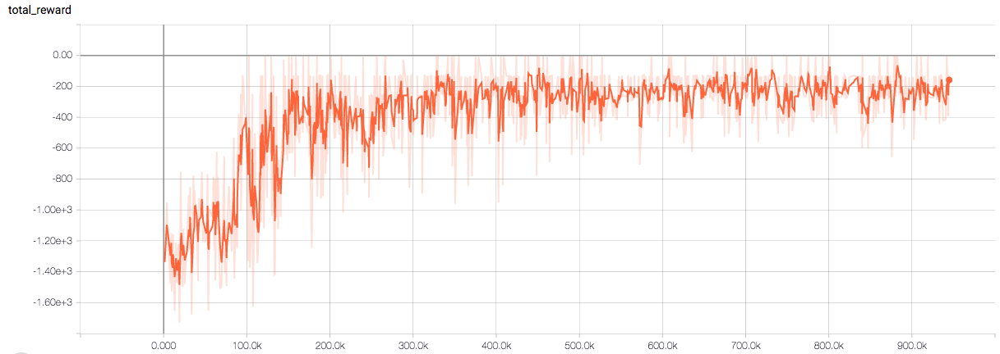
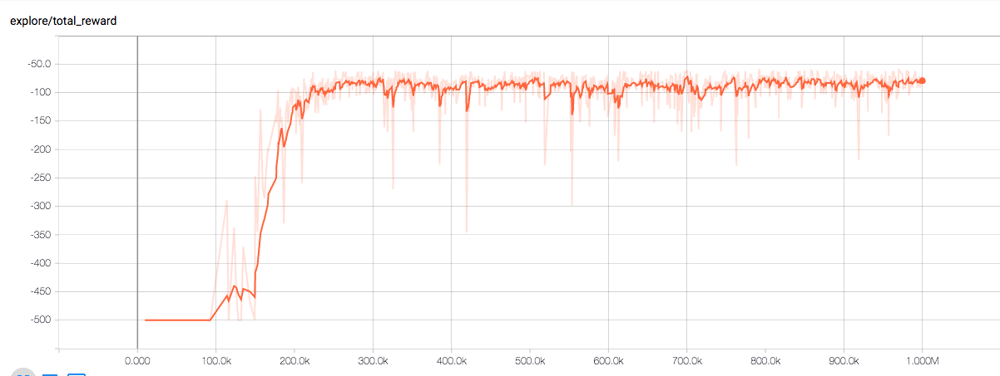
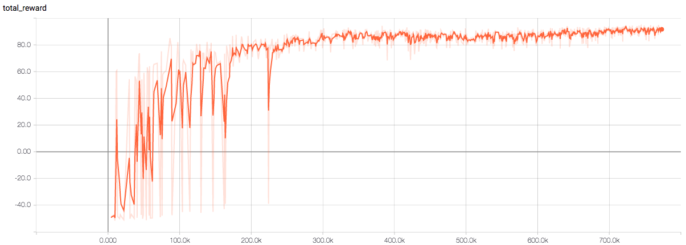

# DeepRL
## Purpose
The implementation of deepRL agents for both discrete and continuous controls, with time series measurements as inputs. 

### Supported algorithms
* [A2C](https://arxiv.org/abs/1602.01783)
* [DDPG](https://arxiv.org/abs/1509.02971)
* [PPO(clip)](https://arxiv.org/abs/1707.06347)
* [Dueling Q (ongoing)](https://arxiv.org/abs/1511.06581)

### Supported NN structures
fully-connected, 1d-convolutional, lstm (on-policy algorithms only). 

## Usage
Define all parameters in `config.ini`, and run `python3 main.py --config-path [path to config.ini]`. This is in run.sh
Multi-processing implementation is at multiprocess branch, in which the global wt and local batch are maintained in queues. It is not as optimal as the multi-threading implementation due to the potential lag between the generation and consumpution of each local batch.

In config-path, the variable BASE DIR has the directory where results are present. Go there on your machine and it will have subfolders of log/, model/.
To monitor progress on tensorboard, type `python -m tensorflow.tensorboard --logdir=.` which will launch tensorboard and you can monitor progress on a browser window. Some example plots are below.

## Example results
**continuous control**     | discrete control
:-------------------------:|:--------------------------:
Pendulum                   | Acrobot
       | 
MountainCarContinuous      | MountainCar
    | 

detailed config files are located under `./docs`.

