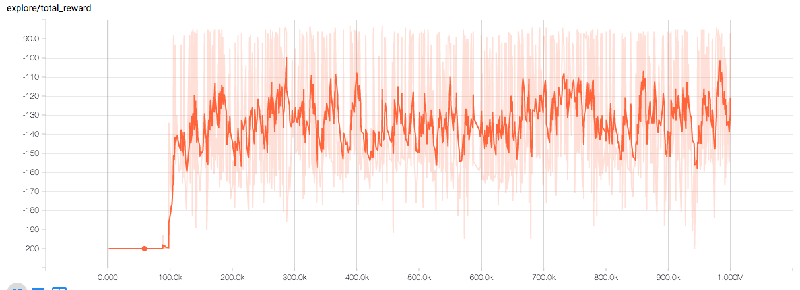

# DeepRL
## Purpose
The implementation of deepRL agents for both discrete and continuous (only single dimension) controls. The inputs are time series measurements and the output is the control. 

## Usage
Define all parameters in `config.ini`, and run `python3 main.py --config-path [path to config.ini]`.
Multi-processing implementation is at multiprocess branch, in which the global wt and local batch are maintained in queues. It is not as optimal as the multi-threading implementation due to the potential lag between the generation and consumpution of each local batch.

## Example results
**continuous control**     | discrete control
:-------------------------:|:--------------------------:
Pendulum                   | Acrobot
       | 
MountainCarContinuous      | MountainCar
    | 

detailed config files are located under `./docs`.
